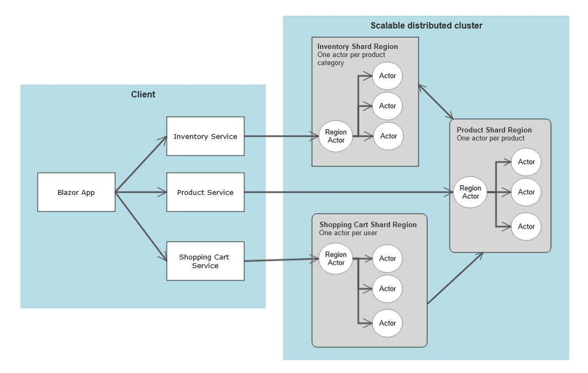

# Akka.NET: Shopping Cart App

A canonical shopping cart sample application, built using Akka.NET. This app shows the following features:

- **Shopping cart**: A simple shopping cart application that uses Akka.NET for its cross-platform framework support, and its scalable distributed applications capabilities.

    - **Inventory management**: Edit and/or create product inventory.
    - **Shop inventory**: Explore purchasable products and add them to your cart.
    - **Cart**: View a summary of all the items in your cart, and manage these items; either removing or changing the quantity of each item.


## Features

- [.NET 6](https://docs.microsoft.com/dotnet/core/whats-new/dotnet-6)
- [ASP.NET Core Blazor](https://docs.microsoft.com/aspnet/core/blazor/?view=aspnetcore-6.0)
- [Akka.NET: Akka.Persistence](https://getakka.net/articles/persistence/architecture.html)
    - [Azure Storage persistence](https://github.com/petabridge/Akka.Persistence.Azure/)
- [Akka.NET: Akka.Management](https://github.com/akkadotnet/Akka.Management/)
    - [Akka.Management.Cluster.Bootstrap](https://github.com/akkadotnet/Akka.Management/tree/dev/src/cluster.bootstrap/Akka.Management.Cluster.Bootstrap)
    - [Akka.Discovery.Azure](https://github.com/akkadotnet/Akka.Management/tree/dev/src/discovery/azure/Akka.Discovery.Azure)
- [Azure Bicep](https://docs.microsoft.com/azure/azure-resource-manager/bicep)
- [Azure App Service](https://docs.microsoft.com/azure/app-service/overview)

The app is architected as follows:



## Get Started

### Prerequisites

- A [GitHub account](https://github.com/join)
- The [.NET 6 SDK or later](https://dotnet.microsoft.com/download/dotnet)
- The [Azure CLI](https://docs.microsoft.com/en-us/cli/azure/install-azure-cli)
- A .NET integrated development environment (IDE)
    - Feel free to use the [Visual Studio IDE](https://visualstudio.microsoft.com) or the [Visual Studio Code](https://code.visualstudio.com)

### Quickstart

1. `git clone git@github.com:petabridge/azure-app-service-akkadotnet.git akka-on-app-service`
2. `cd akka-on-app-service`
3. `dotnet run --project src\Akka.ShoppingCart\Akka.ShoppingCart.csproj`

## Deploying To Azure App Services

### Create a Resource Group

Before deploying the app, you need to create an Azure Resource Group (or you could choose to use an existing one). To create a new Azure Resource Group, use one of the following articles:

- [Azure Portal](https://docs.microsoft.com/en-us/azure/azure-resource-manager/management/manage-resource-groups-portal#create-resource-groups)
- [Azure CLI](https://docs.microsoft.com/en-us/azure/azure-resource-manager/management/manage-resource-groups-cli#create-resource-groups)
- [Azure PowerShell](https://docs.microsoft.com/en-us/azure/azure-resource-manager/management/manage-resource-groups-powershell#create-resource-groups)

### Prepare For Azure Deployment

The app will need to be packaged for deployment. In the `Akka.ShoppingCart` project we define a `Target` element that runs after the `Publish` step. This will zip the publish directory into a _cluster.zip_ file:

```xml
<Target Name="ZipPublishOutput" AfterTargets="Publish">
    <Delete Files="$(ProjectDir)\..\..\cluster.zip" />
    <ZipDirectory SourceDirectory="$(PublishDir)" DestinationFile="$(ProjectDir)\..\..\cluster.zip" />
</Target>
```

In this tutorial, we will be using Azure CLI and Azure Bicep to create all of the resources needed by the example project and to deploy the packaged _cluster.zip_ file into Azure App Services.

### Provision Required Azure Resources

We will use PowerShell, Azure CLI, and the provided .bicep files to automate our Azure resource creation. In PowerShell, navigate to the project directory and deploy the resources using [az deployment group create](https://docs.microsoft.com/en-us/cli/azure/deployment/group#az-deployment-group-create).

Please replace _<resource-group-name>_ with the name of the Azure Resource Group you created earlier and replace _<unique-application-name>_ with a unique name to identify your web application.

```shell
az deployment group create `
  --resource-group <resource-group-name> `
  --template-file 'flex/main.bicep' `
  --parameters appName=<unique-application-name> `
  --debug
```

### Publishing And Deploying The Sample Project

Publish the Akka.ShoppingCart project by using the [dotnet publish](https://docs.microsoft.com/en-us/dotnet/core/tools/dotnet-publish) command in PowerShell

```shell
dotnet publish --configuration Release .\src\Akka.ShoppingCart\Akka.ShoppingCart.csproj 
```

Deploy the published _cluster.zip_ file to Azure App Services using [az webapp deploy](https://docs.microsoft.com/en-us/cli/azure/webapp#az-webapp-deploy). Again, please replace _<resource-group-name>_ and _<unique-application-name>_ the same names you used in the earlier step.

```shell
az webapp deploy --name <unique-application-name> `
  --resource-group <resource-group-name> `
  --clean true --restart true `
  --type zip --src-path cluster.zip --debug
```

Azure App Service will take a few minutes to spin up the web application that will contain a single node Akka.NET cluster. To view the deployed web application, you can go to `https://<unique-application-name>.azurewebsites.net`.

### See Akka.Discovery.Azure In Action

You can see `Akka.Discovery.Azure` in action by scaling out and increasing the minimum number of server instances in your Azure App Service Plan via Azure Portal.

- In the Azure portal, select your web app name (App service), and in the left menu pane, under __Settings__, select __Scale out (App Service plan)__. The __Scale out (App Service plan)__ pane appears.
- On the __Configure tab__, select __Manual scale__ and set the __Instance count__ to 5. In the top menu bar, select Save.


Use the _Cluster Status_ link on the left navigation bar of the deployed website to monitor the cluster state changes as new nodes joins the cluster in real time.

## Explore The Bicep Templates

The Bicep files used in this example is nearly identical to the one used in the [Orleans example](https://docs.microsoft.com/en-us/dotnet/orleans/deployment/deploy-to-azure-app-service#explore-the-bicep-templates). As noted in their documentation, one very important `resource` is that of the Virtual Network. The `vnet` resource enables the Azure App Service to communicate with the Akka.NET cluster.

To read more about the Bicep files and how they are used in resource provisioning, please read the [documentation](https://docs.microsoft.com/en-us/dotnet/orleans/deployment/deploy-to-azure-app-service#explore-the-bicep-templates). 

## Acknowledgements

The Akka.ShoppingCart project uses the following 3rd party open-source projects:

- [MudBlazor](https://github.com/MudBlazor/MudBlazor): Blazor Component Library based on Material design.
- [Bogus](https://github.com/bchavez/Bogus): A simple fake data generator for C#, F#, and VB.NET.
- [Blazorators](https://github.com/IEvangelist/blazorators): Source-generated packages for Blazor JavaScript interop.

Derived from: 
- [Azure-Samples/Orleans-Cluster-on-Azure-App-Service](https://github.com/Azure-Samples/Orleans-Cluster-on-Azure-App-Service).
- [IEvangelist/orleans-shopping-cart](https://github.com/IEvangelist/orleans-shopping-cart).
